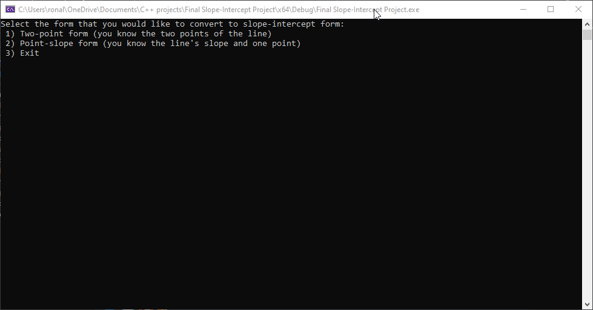

# SlopeIntercept-project
a program made in C++ design to convert either two-point form or point-slope form into slopeintercept form, calculate the line’s length, angle, and degrees and graph the line with class objects. This program was meant to be my final exam of my Programming methodology class (COP 2001) at Florida Gulf Coast University (FGCU).

## Demonstration

Here is an animated gif of the program running, show casing some of its main features.  
   

## Built With
* C++ project using Visual Studio.
* IDE: Microsoft Visual Studio Community 2019. 

## Contributing
Because of the timespan there were many things that I have to leave out. Thus, the program still has much room for improvement such as: labeling the points, line and the graph itself.  

## Author

* Ronald Quiroz.

## License

[License](LICENSE)  

## Acknowledgments

* My professor and the extra resources he gave us really helped me to learn what I was doing here.
* I appreciate the help of my professor Paul Allen for teaching me as best as he could up to this point.

## History

This is the final version of a program design to be turned in as a final exam.

